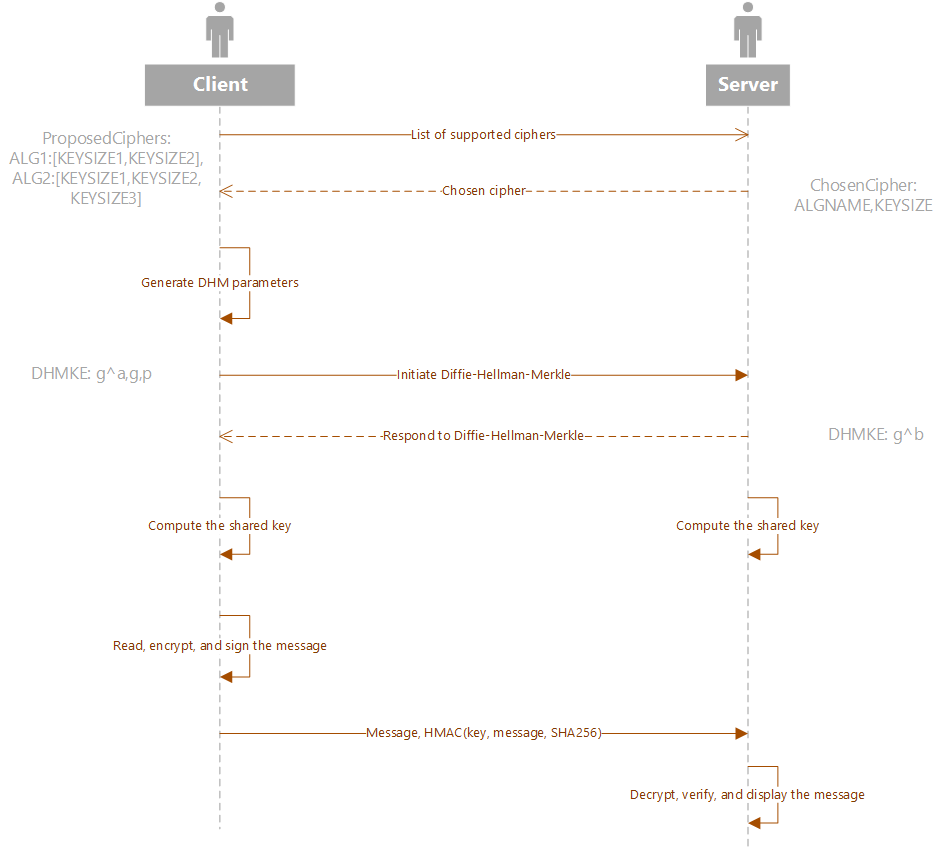

# Custom VPN

Write a network application (*client* and *server*) that would facilitate a secure message exchange. Client and server should start by negotiating the cryptosystem (cipher) to be used (AES, Triple DES, or Blowfish) and establishing the key (using Diffie-Hellman-Merkle key exchange from the `diffiehellman`). Each message should be properly encrypted and authenticated with *HMAC* (using *SHA256* hashing).

## Server

1. Start the server:
   1. Create a socket.
   2. Bind the socket.
   3. Listen on **TCP** port **4600** for incoming connections.
2. Negotiate the cipher:
   1. Read a list of supported cryptosystems (ciphers and keys) from the file *server_cipher.toml*
   2. Wait for the client's message with a list of proposed cryptosystems.
   3. Parse the proposal and compare it to the supported ciphers.
   4. Pick the cryptosystem that both client and server support. Prefer a system with the longest key.
   5. Generate a response with the chosen cipher and key size.
   6. Send the response (or an error) to the client
3. Establish the key:
   1. Initialize DHM object and generate server's public information.
   2. Wait for the client's message with its public Diffie-Hellman-Merkle information.
   3. Parse the client's message.
   4. Generate shared secret based on client's information.
   5. Send server's public information to the client.
   6. Get *key*, and *IV* from the computed shared key.
   7. The key will be used for integrity (HMAC).
4. Initialize `crypto` object using `cipher`, `key`, and `IV`. Use *CBC* mode.
5. Initialize HMAC object using `key`. Use *SHA256*.
6. Main event loop:
   1. Read data from the socket.
   2. If the client did not send anything, close the connection.
   3. Get the encrypted message and *HMAC* from the received data.
   4. Decrypt the ciphertext
   5. Print the received plaintext.
   6. Validate *HMAC*.
   7. Respond to the client with the plaintext reversed (hello -> olleh). The response does not need to be encrypted.
   8. Keep responding until the client initiates the session disconnection.

## Client

1. Start the client:
   1. Create a socket.
   2. Connect to the server (*localhost* by default).
2. Negotiate the cipher:
   1. Read a list of supported cryptosystems (ciphers and keys) from the file *server_cipher.toml*
   2. Generate a proposal (supported cryptosystems).
   3. Send the proposal to the server.
   4. Wait for the server's response with its choice of the cryptosystem.
   5. Parse server's response.
   6. Print the selected cryptosystem (name and key size).
3. Establish the key:
   1. Initialize DHM object and generate client's public information.
   2. Generate the DHMKE message and send it to the server.
   3. Wait for the server's response and parse it.
   4. Generate shared DHM secret.
   5. Get *key*, and *IV* from from the computed shared key.
   6. The key will be used for integrity (HMAC).
4. Initialize `crypto` object using `cipher`, `key`, and `IV`. Use *CBC* mode.
5. Initialize HMAC object using `key`. Use *SHA256*.
6. Main event loop:
   1. Ask the user to enter a phrase
   2. If the phrase is *\quit*, close the connection
   3. Encrypt the plaintext and calculate *HMAC* if the ciphertext
   4. Send the message to the server
   5. Receive the response (inverted plaintext or an error) from the server and print it.
   6. Keep asking for more user input until *\quit* is entered.

## Message format

See the *capture.pcapng* for details.

* Proposed ciphers (client -> server)

```text
ProposedCiphers:alg1:[keysize1,keysize2,keysize3],alg2:[keysize1,keysize2]
```

* Chosen crypto (server -> client)

```text
ChosenCipher:algoname:keysize
```

* DHM key exchange initial message format (client -> server)

```text
DHMKE:number
```

* DHM key exchange response message format (server -> client)

```text
DHMKE:number
```

## Exchange

### Diagram



### Session (Server side)

```text
$ python3 src/projects/vpn/server.py
Listening on ubuntu:4600
New client: 127.0.0.1:46596
Negotiating the cipher
We are going to use AES256
Negotiating the key
The key has been established
Received: hello
Received: bye
```

### Session (Client side)

```text
$ python3 src/projects/vpn/client.py
Connected to ubuntu:4600
Negotiating the cipher
We are going to use AES256
Negotiating the key
The key has been established
Enter message: hello
Server says: olleh
Enter message: bye
Server says: eyb
Enter message: \quit
```

### Session. Capture

[Wireshark capture](capture.pcapng)

## References

* [socket — Low-level networking interface — Python 3.13.3 documentation](https://docs.python.org/3/library/socket.html)
* [Socket Programming HOWTO — Python 3.13.3 documentation](https://docs.python.org/3/howto/sockets.html)
* [Socket Programming in Python (Guide) – Real Python](https://realpython.com/python-sockets/)
* [localhost - Wikipedia](https://en.wikipedia.org/wiki/Localhost)
* [Welcome to PyCryptodome’s documentation — PyCryptodome 3.230b0 documentation](https://www.pycryptodome.org/)
* [diffiehellman](https://pypi.python.org/pypi/diffiehellman)
